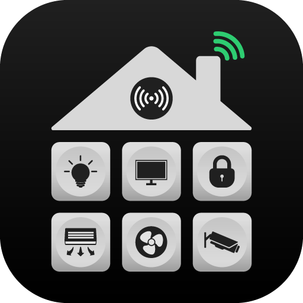

# Dashboard - Модуль панели управления

Настраиваемая система панели управления для отображения и организации объектов с гибкими опциями группировки.

## Описание

Модуль `Dashboard` предоставляет интерфейс панели управления для платформы osysHome. Он позволяет пользователям просматривать объекты, организовывать их по классам или пользовательским свойствам и настраивать свой опыт работы с панелью управления.

## Основные возможности

- ✅ **Отображение объектов**: Отображение объектов с их шаблонами
- ✅ **Гибкая группировка**: Группировка по классам, пользовательским свойствам или без группировки
- ✅ **Пользовательские группы**: Создание правил пользовательской группировки
- ✅ **Подстановка значений**: Настройка заголовков групп с подстановкой значений
- ✅ **Пользовательские предпочтения**: Сохранение пользовательских предпочтений панели управления
- ✅ **Обновления в реальном времени**: WebSocket обновления для изменений объектов

## Опции группировки

### Без группировки
- Отображение всех объектов в одном виде
- Простой плоский список

### По классам
- Группировка объектов по их иерархии классов
- Отображение описаний классов
- Иерархическая организация

### Пользовательские группы
- Группировка по любому свойству объекта
- Поддержка вложенных свойств (object.property)
- Подстановка значений для отображения
- Показать/скрыть неопределенные значения

## Панель администратора

Модуль предоставляет интерфейс конфигурации:

### Настройки
- **Включить группировку по классам**: Переключение группировки по классам
- **Скрыть приветственное сообщение**: Скрыть приветственное сообщение на панели управления
- **Скрыть опцию "Без группировки"**: Скрыть опцию "Без группировки"
- **Пользовательские группы**: Настройка правил пользовательской группировки

### Конфигурация пользовательской группы
- **Имя группы**: Отображаемое имя группы
- **Иконка**: Иконка Font Awesome для группы
- **Имя свойства**: Свойство для группировки
- **Свойство объекта**: Вложенное свойство (опционально)
- **Показать неопределенные**: Показать объекты без значения свойства
- **Подстановка значений**: Сопоставление значений с отображаемыми именами

## Использование

### Просмотр панели управления

1. Перейдите в Dashboard (`/Dashboard/index`)
2. Выберите опцию группировки из выпадающего списка
3. Просмотрите объекты, организованные по выбранной группировке
4. Предпочтение группы сохраняется для каждого пользователя

### Настройка пользовательских групп

1. Перейдите в панель администратора Dashboard
2. Добавьте пользовательскую группу
3. Настройте правила группировки
4. Установите подстановку значений
5. Сохраните конфигурацию

## Технические детали

- **Рендеринг объектов**: Использует шаблоны объектов для отображения
- **Логика группировки**: Гибкая группировка на основе свойств
- **Пользовательские предпочтения**: Хранятся в свойствах объекта пользователя
- **WebSocket**: Обновления объектов в реальном времени
- **API**: JSON API для данных панели управления

## Версия

Текущая версия: **1.0**

## Категория

App

## Автор

Eraser

## Требования

- Flask
- Flask-Login
- Основная система osysHome

## Лицензия

См. лицензию основного проекта osysHome

